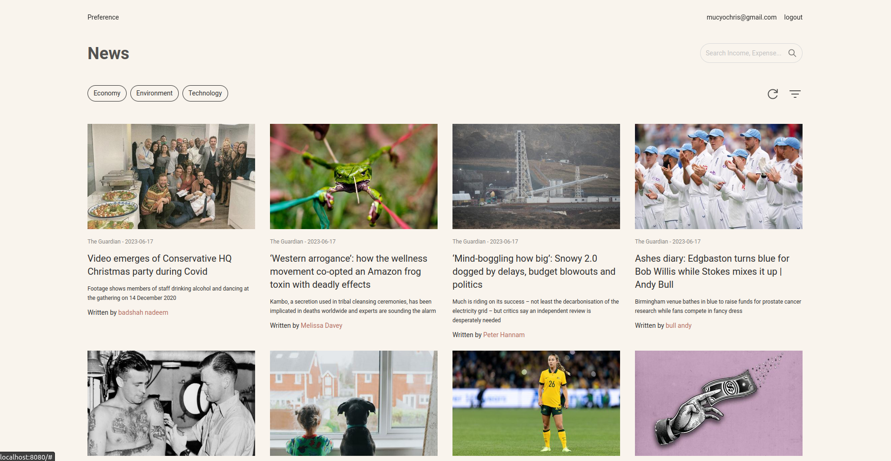
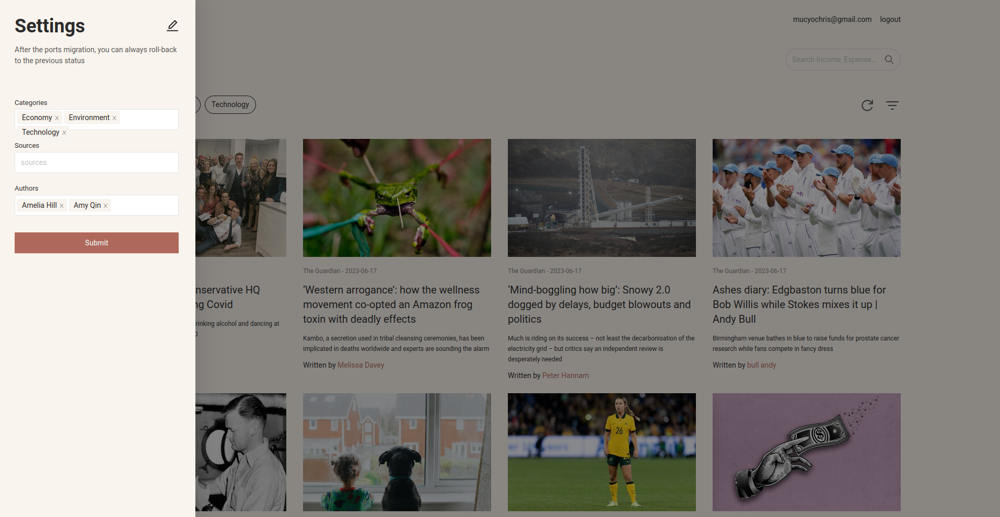

## News-Feed

React Frontend of a news web application





## Testing Guide

Use the guideline below, to run this frontend application.

### Prerequisites

- Have docker installed on Local environment.

### Installation

Create a folder and add in the files below

1. Create an `.env` file, and use the provided configurations within the `env.example` file as a boilerplate.
2. Create a `docker-compose.yml` file, and paste the following configuration:

```shell
version: "3.7"

services:
  newsweb:
    image: mchris12/news-web:1.0
    networks:
      - news-feed
    ports:
      - 8080:8080

networks:
  news-feed:

```

After run `docker compose up -d --build newsweb` to start the application
