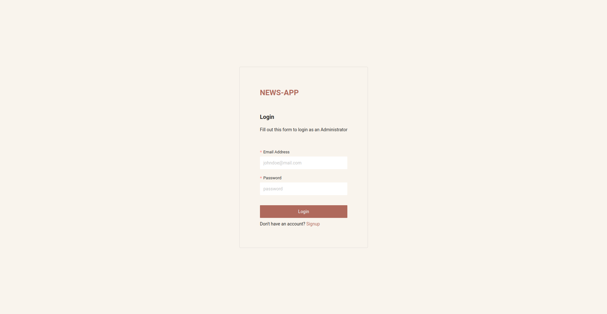

## News-Feed




React Frontend of a news web application

## Execution Guide

To run the both Frontend, you can use the guideline below.

### Requirements

- Have docker installed on Local environment.

Create a `docker-compose.yml` file and add the following instructions

```shell
version: "3.7"

services:
  newsweb:
    image: mchris12/news-web:1.0
    networks:
      - news-feed
    ports:
      - 8080:8080

networks:
  news-feed:
    external: true
    name: news-feed

```

After create `.env` file within the same folder and paste in variable from `.env.example` file. Then modify complying with your configuration especially database credentials.

After adding the file, run `docker compose up`
